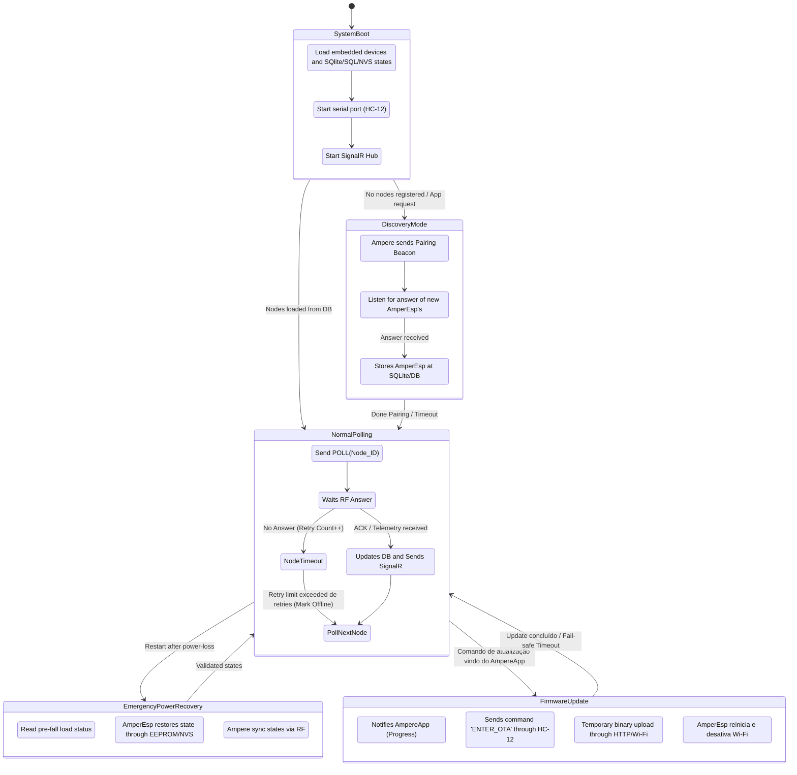
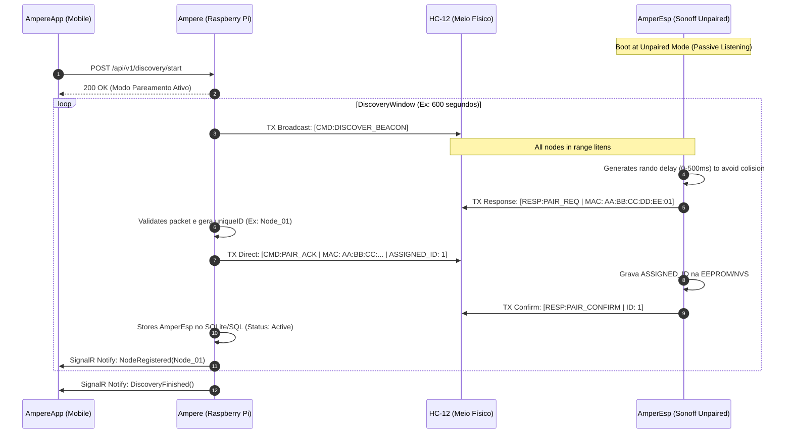
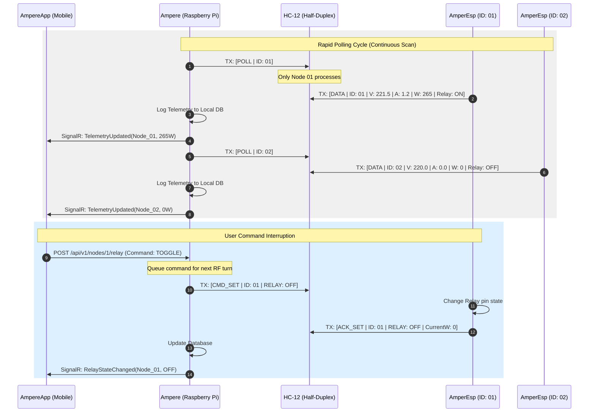
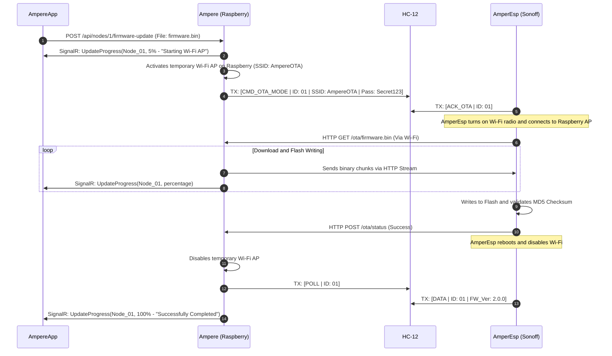

# Project architecture

## Solution model

Ampere uses one project per DDD layer.

The web solution is `Ampere.Web.slnx`.
Its projects are:

- `Ampere`: Presentation.
- `Ampere.Application`: Application.
- `Ampere.Domain`: Domain.
- `Ampere.Infrastructure`: Infrastructure.
- `Ampere.Composition`: DI composition.

The mobile solution is `Ampere.App.slnx`.
It follows the same project-per-layer model.

Mobile is an architectural foundation but
is not the current focus.

## Dependency direction

```text
                 Composition
                 /    |     \
                /     |      \
               v      v       v
      Presentation  Application  Infrastructure
          |             |             |
          |             v             v
          +----------> Domain <-------+
```

The practical rules are:

- Presentation may reference Application.
- Presentation may reference Composition
  for startup composition.
- Application may reference Domain.
- Infrastructure may reference Application
  and Domain.
- Composition may reference all layers.
- Domain must not reference other layers.
- Application must not reference
  Infrastructure.
- Infrastructure must not reference
  Presentation or Composition.

## Responsibilities

### Presentation

Contains UI and transport concerns.

For web this includes:

- Blazor components;
- controllers;
- hosting startup.

Controllers do not contain business rules.
Controllers do not access EF Core.

Razor pages use components only MudBlazor components.
Razor pages and components do not have code-behind files or
external CSS files.

### Application

Contains use cases and application contracts.

Features are organized with:

- Abstractions;
- Commands;
- Handlers;
- Queries;
- Requests;
- Responses;
- Validators.

Application defines abstractions for
infrastructure capabilities.

Mediator uses source-generated typed requests,
handlers and stream handlers.

### Domain

Contains business rules and domain concepts.

Features may contain:

- Entities;
- Enums;
- Events;
- Models.

Domain is independent of external technology.

### Infrastructure

Contains implementations of Application
abstractions and external integrations.

EF Core, database providers, MQTTnet, ASP.NET
Identity infrastructure and other external
dependencies belong here.

### Composition

Contains the composition root.

Dependency injection registrations belong
here. Registrations must be explicit and
compile-time based.

Do not use reflection to discover services.

## Persistence

The persistence flow is:

```text
Presentation
    -> Mediator
    -> Application Handler
    -> Feature Service
    -> IRepository<TEntity>
    -> Infrastructure Repository
    -> DbContext
    -> EF Core
    -> SQL database
```

`IRepository<TEntity>` belongs to Application.
Its implementation belongs to Infrastructure.

Feature Services consume the repository.
They must not inject or use `DbContext`.

If direct context access becomes unavoidable,
create a dedicated Infrastructure repository
whose Application abstraction hides the context.

`IUnitOfWork` belongs to Application and its
implementation belongs to Infrastructure.
Repositories do not call SaveChangesAsync.

Transactional requests are coordinated by
the transaction pipeline in Infrastructure.

## SignalR

SinalR is an Presentation dependency, but the
service abstraction (Interface) belongs to
`Application/Common/Abstractions` and its
implementation goes to `Infrastructure/Common/Hubs/`.

Signal configuration is persisted through
`IRepository<SignalRConfigurationEntity>`.

A hosted startup service creates a scope and
starts the broker when `StartOnBoot` is enabled.

Live messages are exposed through Mediator
`IStreamRequest<T>` and consumed by the REST
stream endpoint and Blazor live page.

No `dynamic` or reflection may be
used against any assemblies.

## Shared domain base

Persisted entities implement `IEntityBase`.
Domain entities should inherit `EntityBase`.

The base contract contains:

- `Id`;
- `CreatedAt`;
- `CreatedBy`;
- `UpdatedAt`;
- `UpdatedBy`.

Identifiers use `Guid.CreateVersion7()`.

ASP.NET Identity entities may implement the
contract directly because Identity already
provides their framework base classes.

## Testing

Web unit tests live under:

`tests/web/Ampere.UnitTests`

Shared fixtures and fakes live under
`Common/Fixtures` and `Common/Mocks`.
Also, shared Stubs goes to `Common/Stubs`.
Feature tests live in feature directories.

Coverlet collector generates Cobertura XML.
All the feature scope requires
at least 80 percent line and branch coverage.

The CI job publishes the coverage report in
the GitHub Actions summary and fails below
that threshold.

## Mobile

The mobile application follows the same
layered project structure:

- Presentation;
- Application;
- Domain;
- Infrastructure;
- Composition.

Platform-specific MAUI code remains inside
the Presentation project or appropriate
platform boundary.

## IoT and OS

`src/iot` is reserved for embedded device
software (`AmperEsp`).

`src/os` is reserved for Raspberry Pi OS
customization (`AmperOS`).

Neither area should introduce dependencies
from web Presentation into device software.

Integration contracts must be explicit.

## Project States and Data Flow

### General system states overview



### Setup, Discovery and Pairing Data Flow



### Normal Operation: Telemetry Polling and Command Sending



### Firmware Update (OTA Transition State)


