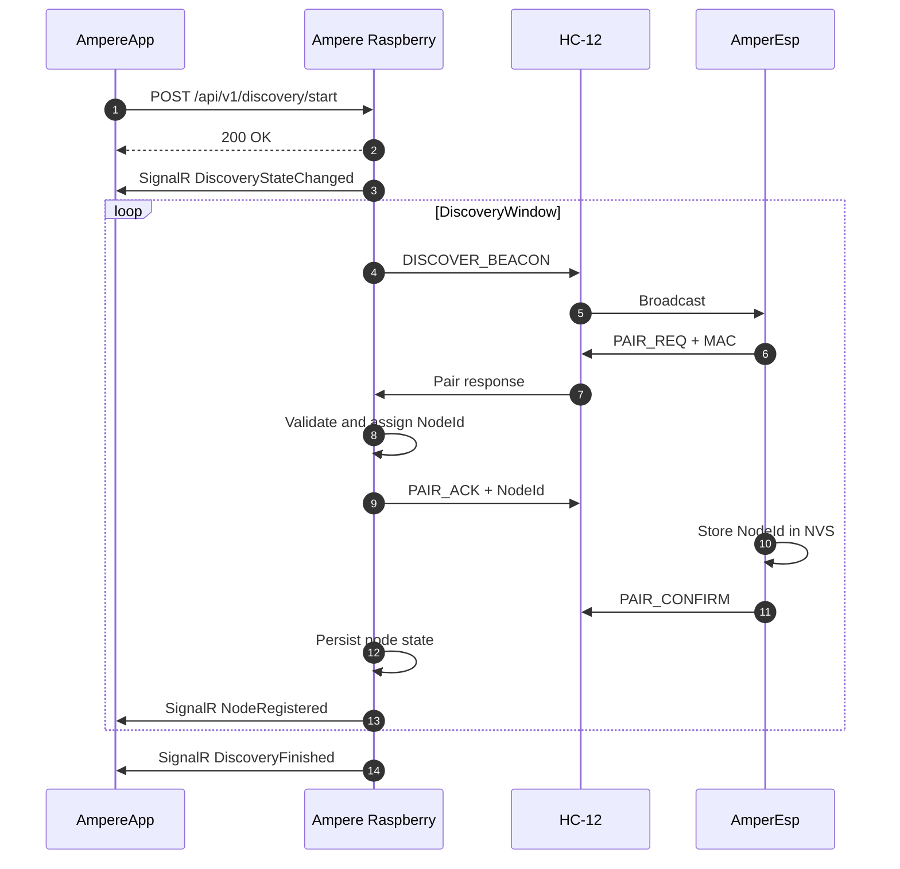
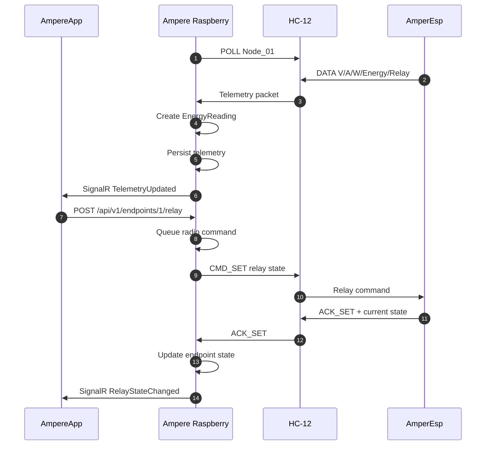
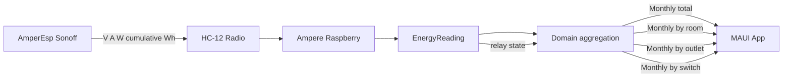
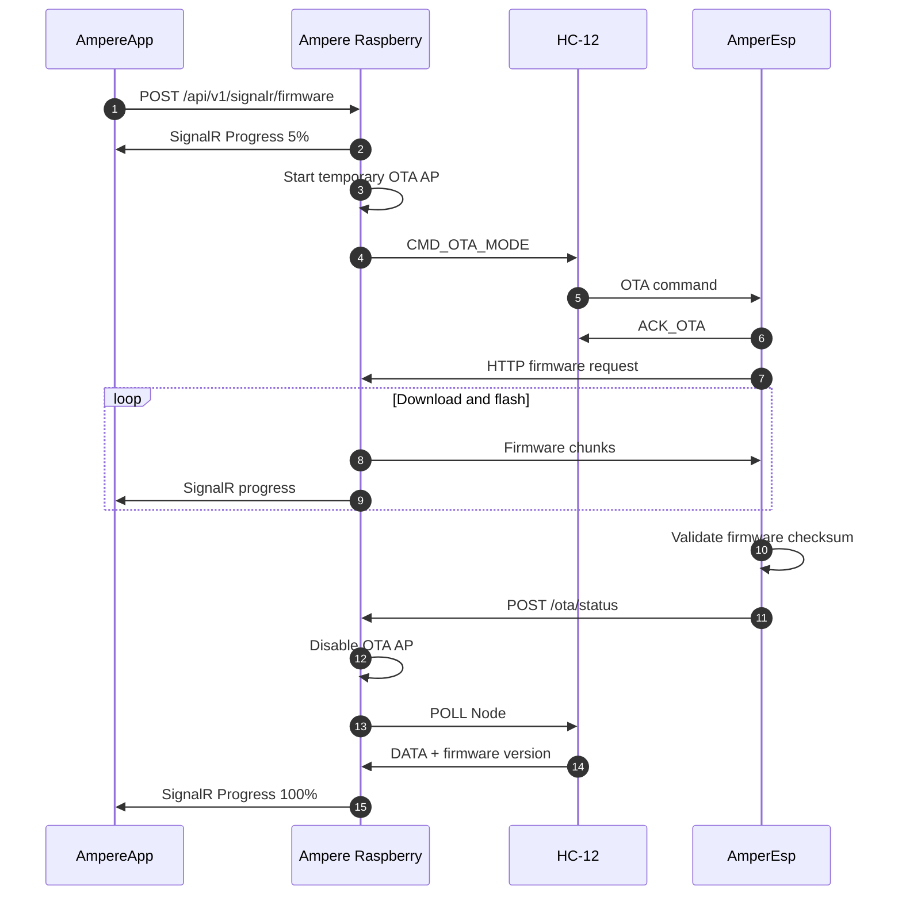

# Project architecture

## Solution model

Ampere uses one project per DDD layer.

The web solution is `Ampere.Web.slnx`.
Its projects are:

- `Ampere`: Presentation.
- `Ampere.Application`: Application.
- `Ampere.Domain`: Domain.
- `Ampere.Infrastructure`: Infrastructure.
- `Ampere.Composition`: DI composition.

The mobile solution is `Ampere.App.slnx`.
It follows the same project-per-layer model.

Mobile is an architectural foundation but
is not the current feature focus.

## Dependency direction

```text
                 Composition
                 /    |     \
                /     |      \
               v      v       v
      Presentation  Application  Infrastructure
          |             v             |
          |----------> Domain <--------|
```

The practical rules are:

- Presentation may reference Application.
- Presentation may reference Composition
  for startup composition.
- Application may reference Domain.
- Infrastructure may reference Application
  and Domain.
- Composition may reference all layers.
- Domain must not reference other layers.
- Application must not reference
  Infrastructure.
- Infrastructure must not reference
  Presentation or Composition.

## Responsibilities

### Presentation

Contains UI and transport concerns.
For web this includes Blazor components,
controllers and SignalR entrypoints.

Controllers do not contain business rules.
Controllers do not access EF Core.

### Application

Contains use cases and application contracts.
Features are organized with abstractions,
commands, handlers, queries, requests,
responses, notifications and validators.

Mediator uses source-generated typed messages.

### Domain

Contains business rules and domain concepts.
Domain is independent of external technology.

The Ampere domain models:

- houses;
- rooms;
- Sonoff controllers;
- electrical endpoints;
- energy telemetry;
- consumption calculations.

### Infrastructure

Contains implementations of Application
abstractions and external integrations.

EF Core, SQL providers, ASP.NET Identity,
SignalR hub services, serial/radio access and
other external dependencies belong here.

### Composition

Contains the composition root.
Dependency injection registrations belong
here. Registrations are explicit and
compile-time based.

Do not use reflection to discover services.

## Persistence

The persistence flow is:

```text
Presentation
    -> Mediator
    -> Application Handler
    -> Feature Service
    -> IRepository<TEntity>
    -> Infrastructure Repository
    -> DbContext
    -> EF Core
    -> SQL database
```

`IRepository<TEntity>` belongs to Application.
Its implementation belongs to Infrastructure.

Feature Services consume repositories and
must not inject `DbContext`.

`IUnitOfWork` belongs to Application and its
implementation belongs to Infrastructure.
Repositories do not call SaveChangesAsync.

Transactional requests are coordinated by
the transaction pipeline in Infrastructure.

## REST and SignalR

REST is used for simple App-to-Raspberry
requests and resource operations.

SignalR is used for realtime notifications,
telemetry updates and firmware progress.

The SignalR service abstraction belongs to
`Application/Common/Abstractions`.
Its implementation belongs to
`Infrastructure/Common/Hubs`.
The SignalR endpoint is mapped by Presentation.

SignalR transport contracts are explicit.
Incoming App DTOs use the `Request` suffix.
Mediator commands, queries, streams and
notifications use typed responses.

No `dynamic` or reflection is allowed.

## Radio gateway

The Raspberry Pi is the gateway for AmperEsp
Sonoff devices.

The application does not communicate directly
with the radio hardware. The flow is:

```text
AmpereApp
   |
   | REST / SignalR
   v
Ampere Raspberry
   |
   | Application abstraction
   v
Radio gateway / HC-12
   |
   v
AmperEsp Sonoff
```

Radio protocol implementation is isolated
from Domain and Application.

## Project States and Data Flow

### 1. General system states overview

```mermaid
stateDiagram-v2
    [*] --> SystemBoot

    state SystemBoot {
        LoadDatabase: Load house and node state
        InitRadio: Start radio gateway
        StartSignalR: Start SignalR Hub
        LoadDatabase --> InitRadio
        InitRadio --> StartSignalR
    }

    SystemBoot --> DiscoveryMode:
        No nodes registered / App request
    SystemBoot --> NormalPolling:
        Nodes loaded from DB

    state DiscoveryMode {
        BroadcastBeacon: Send discovery beacon
        ListenResponse: Listen for pair response
        RegisterNode: Register AmperEsp node
        NotifyApp: SignalR NodeRegistered
        BroadcastBeacon --> ListenResponse
        ListenResponse --> RegisterNode:
            Pair response received
        RegisterNode --> NotifyApp
    }

    DiscoveryMode --> NormalPolling:
        Pairing complete / timeout

    state NormalPolling {
        PollDevice: Send POLL(Node_ID)
        WaitTelemetry: Wait radio response
        ProcessData: Persist telemetry
        NotifyApp: SignalR TelemetryUpdated
        PollDevice --> WaitTelemetry
        WaitTelemetry --> ProcessData:
            ACK / telemetry received
        ProcessData --> NotifyApp
    }

    state EmergencyPowerRecovery {
        ReadState: Read last known state
        RestoreRelays: Restore relay state
        SyncState: Synchronize through radio
    }

    NormalPolling --> EmergencyPowerRecovery:
        Restart after power loss
    EmergencyPowerRecovery --> NormalPolling:
        State validated

    state FirmwareUpdate {
        NotifyProgress: SignalR progress
        EnterOta: Send ENTER_OTA through radio
        DeployBinary: Upload firmware over Wi-Fi
        RebootDevice: Reboot AmperEsp
    }

    NormalPolling --> FirmwareUpdate:
        REST command from App
    FirmwareUpdate --> NormalPolling:
        Complete / fail-safe timeout
```

### 2. Setup, discovery and pairing data flow



### 3. Normal operation, telemetry and commands



### 4. Energy consumption aggregation data flow



Cumulative energy readings are ordered per
endpoint. Positive deltas are accumulated.
When a device counter resets, the current
reading becomes the new interval baseline.

### 5. Firmware update OTA transition



## Mobile

The mobile application follows the same
layered project structure:

- Presentation;
- Application;
- Domain;
- Infrastructure;
- Composition.

Platform-specific MAUI code remains inside
the Presentation project or appropriate
platform boundary.

## IoT and OS

`src/iot` is reserved for embedded device
software (`AmperEsp`).

`src/os` is reserved for Raspberry Pi OS
customization (`AmperOS`).

Neither area should introduce dependencies
from web Presentation into device software.

Integration contracts must be explicit.
